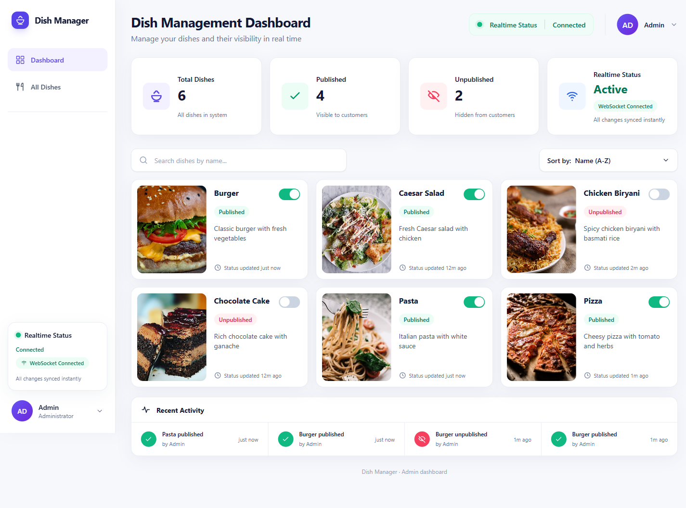
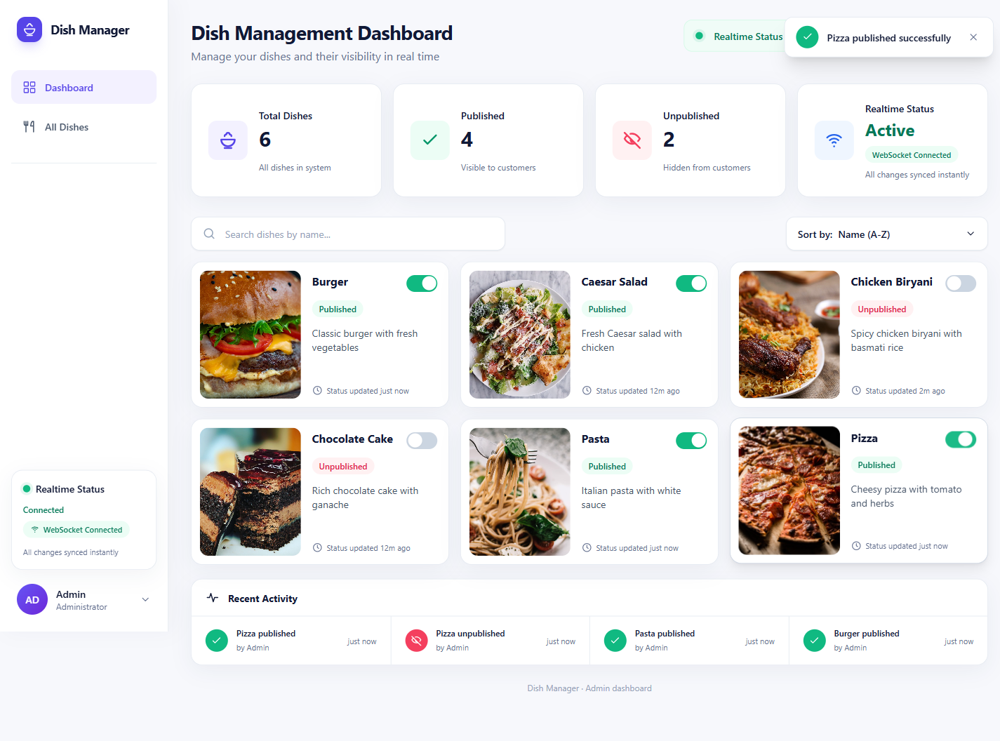
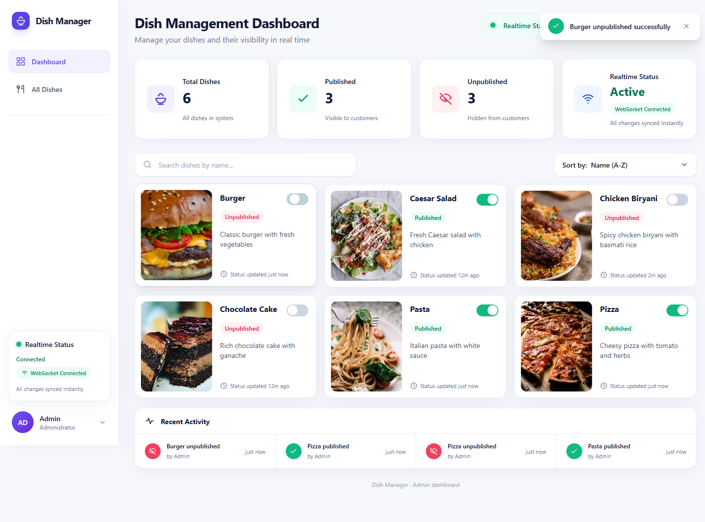
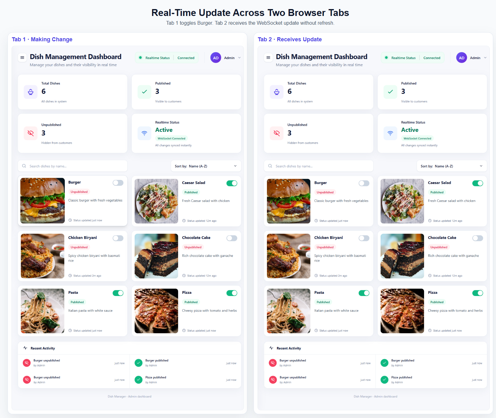

# Dish Management Dashboard

A production-style full-stack dashboard for restaurant administrators to manage dish publish/unpublish status with real-time synchronization across browser sessions.

## Tech Stack

- Frontend: React, Vite, Tailwind CSS
- Backend: FastAPI, SQLAlchemy
- Database: SQLite
- Realtime: FastAPI WebSockets
- State: React hooks only

Project Overview

This application allows restaurant administrators to:

- View all available dishes
- Publish or unpublish dishes
- Monitor dish visibility status
- Track recent publishing activity
- View dashboard statistics
- Receive real-time updates across multiple browser sessions

The project demonstrates API design, database management, frontend integration, and real-time synchronization using WebSockets.

---

##  Assignment Requirements

### Core Requirements

✅ Database Creation

✅ Fetch Dishes API

✅ Toggle Publish Status API

✅ React Dashboard

✅ UI Synchronization

### Bonus Requirement

✅ Real-Time Updates using WebSockets

When a dish is updated from one browser tab or directly from the backend, all connected clients receive updates instantly.

---

##  Additional Features

Beyond the assignment requirements:

- Dashboard Statistics
- Activity Logs
- Search Functionality
- Sorting Functionality
- Multi-Client Synchronization
- Responsive UI

## Project Structure

```text
dish-management-dashboard/
|-- backend/
|   |-- app/
|   |   |-- routes/
|   |   |-- services/
|   |   |-- websocket/
|   |   |-- database.py
|   |   |-- main.py
|   |   |-- models.py
|   |   `-- schemas.py
|   |-- seed.py
|   |-- requirements.txt
|   `-- README.md
|
|-- frontend/
|   |-- public/
|   |   `-- images/
|   |-- src/
|   |   |-- api/
|   |   |-- components/
|   |   |-- hooks/
|   |   |-- pages/
|   |   |-- services/
|   |   `-- utils/
|   |-- package.json
|   `-- vite.config.js
|
|-- screenshots/
|   |-- dashboard.png
|   |-- published.png
|   |-- unpublished.png
|   `-- realtime-sync.png
|
|-- .gitignore
`-- README.md
```

## Backend Setup

```powershell
cd backend
pip install -r requirements.txt
python seed.py
python -m uvicorn app.main:app --reload
```

Backend runs at:

```text
http://127.0.0.1:8000
```

Useful endpoints:

- `GET /health`
- `GET /api/dishes`
- `GET /api/stats`
- `GET /api/activity`
- `PATCH /api/dishes/{id}/toggle`
- `WS /ws`

## Frontend Setup

Open another terminal:

```powershell
cd frontend
npm install
npm.cmd run dev
```

Frontend runs at:

```text
http://localhost:5173
```

## Seed Data

The seed script creates 6 dishes:

- Pizza
- Burger
- Pasta
- Chicken Biryani
- Caesar Salad
- Chocolate Cake

Initial stats:

- Total dishes: 6
- Published: 4
- Unpublished: 2

## Screenshots

### Dashboard



### Published Dish



### Unpublished Dish



### Real-Time Synchronization



## Notes

- The SQLite database is generated locally and ignored by Git.
- Frontend build output and dependencies are ignored by Git.
- Dish images are stored in `frontend/public/images/`.

## Author

Jayakumar M

B.Tech Information Technology

Vel Tech Multi Tech Dr. Rangarajan Dr. Sakunthala Engineering College
